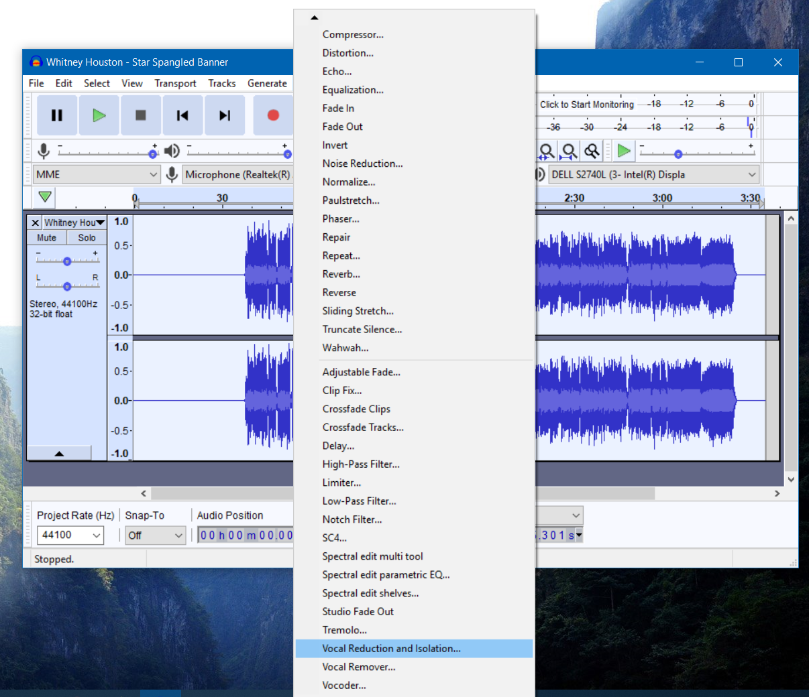

Scope: Remove vocals an audio file.

Instructions: With a file open in Audacity, the user would first click on the Effect 
               tab then scroll to "Vocal Reduction and Isolation" and select this option. 
               A window should open which allows the user to click the action to 
              "Remove Vocals". If so desired, a more advanced options are available to 
              the user to remove vocals at various frequencies.           

