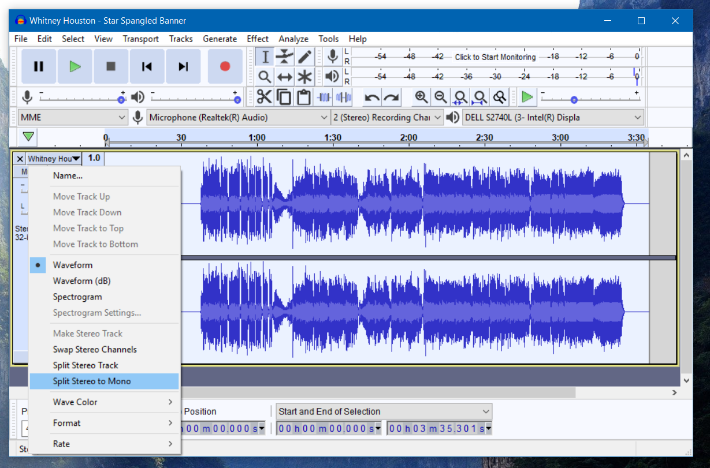
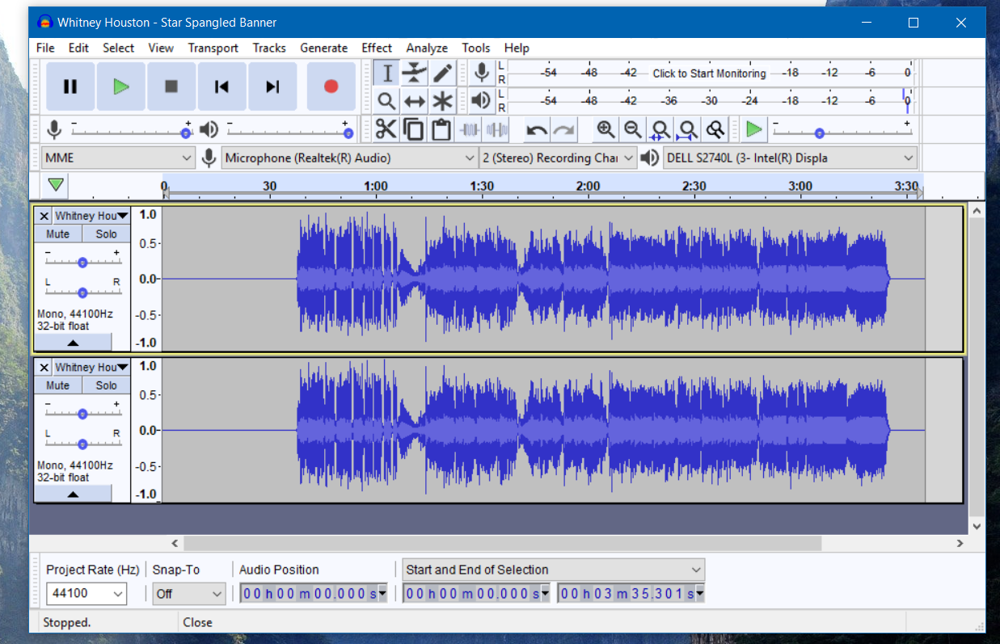

Scope:  For an audio file that has vocals in one channel 
        and the rest of the audio in another the user 
        would be able to isolate the vocals and delete the 
        other channel.

Instructions: With an audio file open in the Audacity software, 
              click on the arrow pointing downward from the "Track 
              Control Panel." After, select "Split Stereo to Mono." This
              should open a separate window so there will be window for
              the vocals and an additional without vocals. In order to 
              delete the channel without vocals, click on the "X" to the 
              left of the downward pointing arrow. 
              

